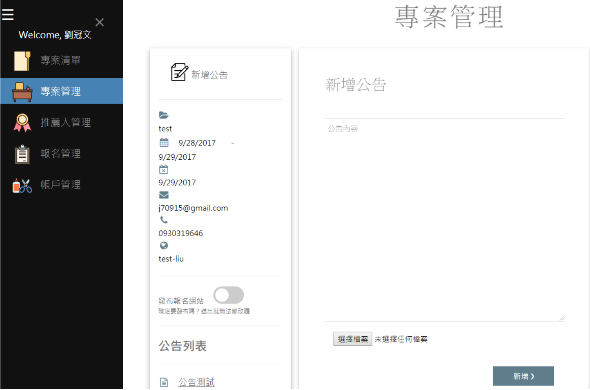
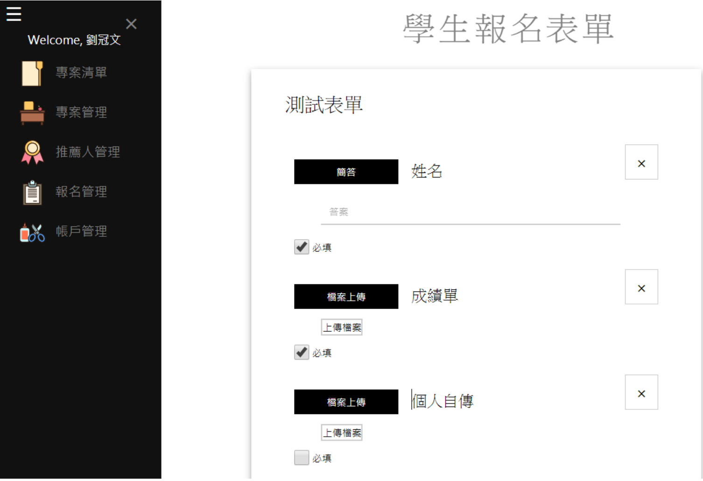
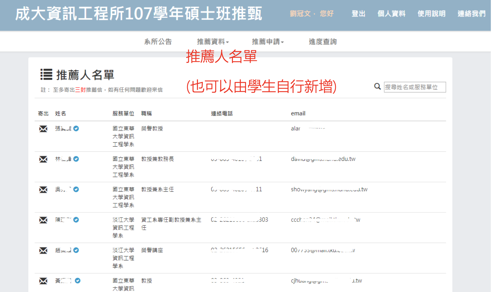
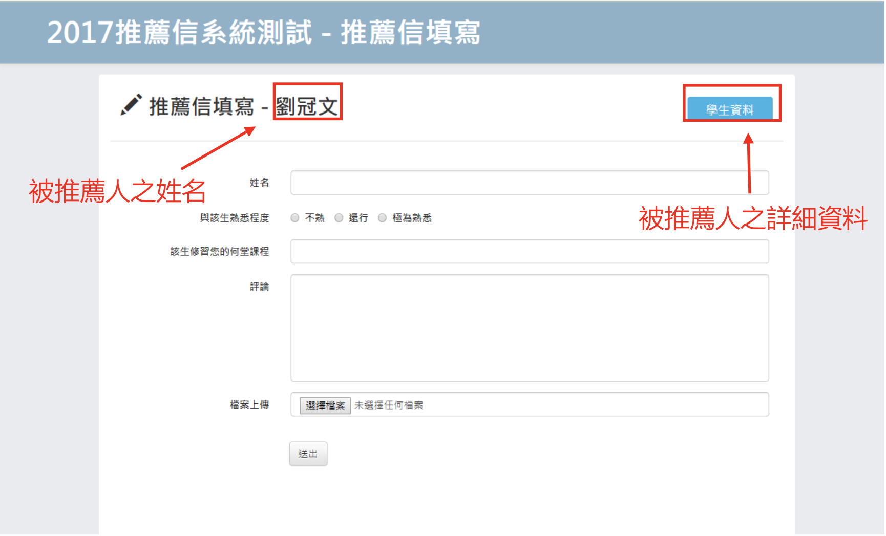

# RMD-Letter web

This platform is designed for electronic recommendation letter system for master's degree. Use nodejs and mongodb to set up the backend, and saved the users' files on AWS S3. 
It was used at the master's selection of Department of Computer Science in National Cheng Kung University in 2017.

## Introduction
### For Departments Office  
| Mantain announcements | Create recommended letter format |
| ---- | ---- |
|  |  |

### For Student
| Different subdomains for different departments | Entrance |
| ---- | ---- |
|  |  |

| Chose recommended person | Fill your in information |
| ---- | ---- |
|  |  |

## Develop Environment Setup
Node v6.10.0
### MongoDB

macOS

```
brew install mongodb
```

### Redis

macOS

```
brew install redis
```

### nodemon

```
npm install nodemon -g
```

### npm packages

```
npm install
```

### DNS

#### Dnsmasq (macOS or Linux)

[Reference](http://asciithoughts.com/posts/2014/02/23/setting-up-a-wildcard-dns-domain-on-mac-os-x/)

Install Dnsmasq

```
# Install it
brew install dnsmasq

# Create the etc dir if needed
mkdir -p /usr/local/etc

# Create a simple configuration
# This forces the .dev domain to respond with 127.0.0.1
# You can find more information in the default config file:
#   /usr/local/opt/dnsmasq/dnsmasq.conf.example
echo "address=/localhost/127.0.0.1" > /usr/local/etc/dnsmasq.conf

# Install the daemon startup file
sudo cp -fv /usr/local/opt/dnsmasq/*.plist \
  /Library/LaunchDaemons

# Start the daemon
sudo launchctl load \
  /Library/LaunchDaemons/homebrew.mxcl.dnsmasq.plist
```

Configure macOS

```
# man 5 resolver
sudo mkdir -p /etc/resolver
sudo sh -c 'echo "nameserver 127.0.0.1" > /etc/resolver/dev'
```

Dnsmasq to DNSAgent [rules convert tool](https://stackia.github.io/masq2agent/)

#### DNSAgent (Windows)

[DNSAgent  Download](https://github.com/stackia/DNSAgent/releases/latest)

options.cfg:

```
{
    "HideOnStart": false,
    "ListenOn": "127.0.0.1:3000, [::1]",  //port 3000
    "DefaultNameServer": "119.29.29.29",
    "UseHttpQuery": false,
    "QueryTimeout": 4000,
    "CompressionMutation": false,
    "CacheResponse": true,
    "CacheAge": 86400,
    "NetworkWhitelist": null
}
```

rules.cfg:

```
[
    {
        "Pattern": "^(.*\\.)?localhost$",
        "Address": "127.0.0.1"
    }
]
```

## Editor Setup

1 tab = 2 whitespace !!!

```
npm install eslint -g
```

### Sublime

#### Install Packages

* [Package Control](https://packagecontrol.io/installation)
* [Babel](https://packagecontrol.io/packages/Babel)
* [SublimeLinter](https://packagecontrol.io/packages/SublimeLinter)
* [SublimeLinter-contrib-eslint](https://packagecontrol.io/packages/SublimeLinter-contrib-eslint)

## Start Server

### MongoDB

```
sudo mongod
```

### Redis

```
redis-server
```

### Web Server

```
npm start
```
